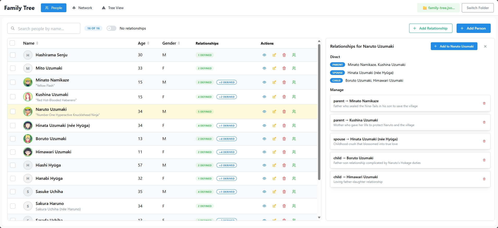
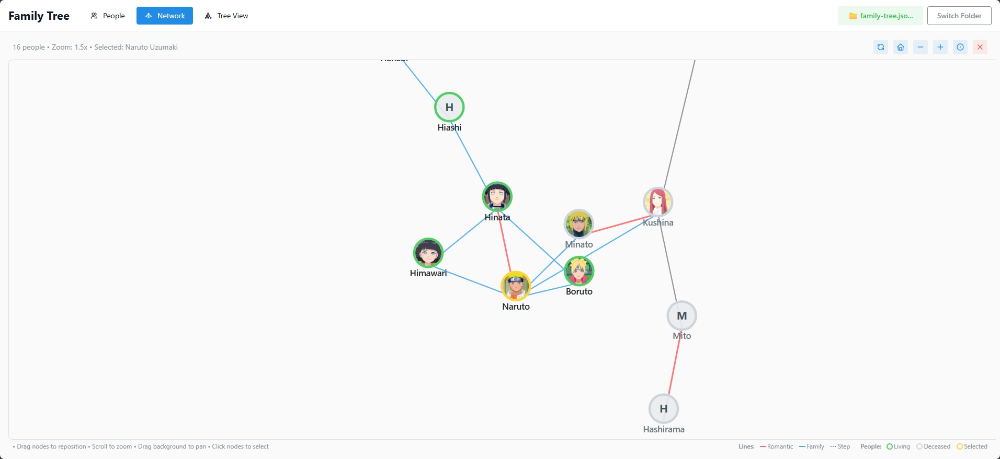
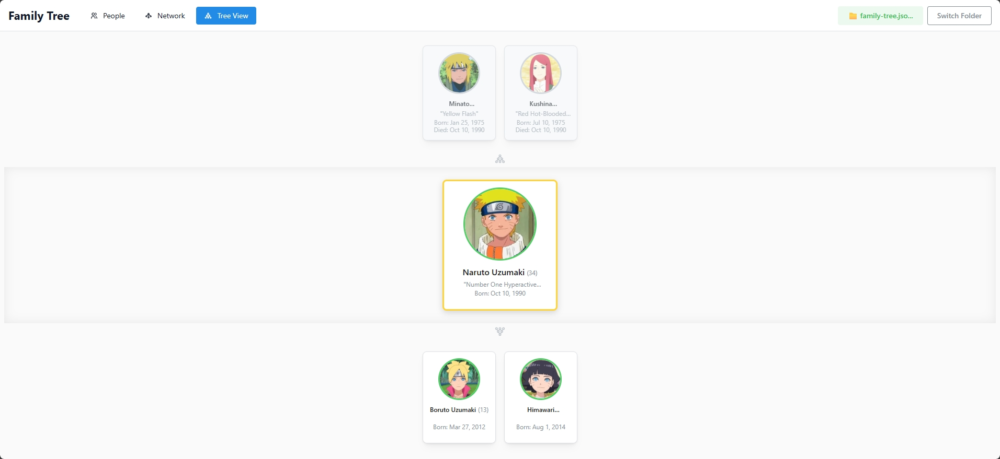

# Family Tree Application

A modern, interactive family tree application built with React, TypeScript, and D3.js. Features offline-first design with local file storage and an intuitive interface for managing family relationships.

   

## 📸 Screenshots

### 👥 People Management


_Manage family members, add photos, and define relationships_

### 🌐 Interactive Network View


_Explore your family connections with an interactive D3.js visualization_

### 🌳 Hierarchical Tree View


_View traditional family trees focused on specific individuals_

## ✨ Features

### Current MVP Features (v0.0.1)

- **👥 People Management**: Add, edit, and delete family members with detailed information
- **📷 Photo Management**: Upload, crop, and optimize photos with automatic WebP conversion and file storage
- **🔗 Relationship Management**: Define and manage various family relationships (parent-child, spouse, partner, etc.)
- **🌐 Interactive Network Visualization**: Explore your family network with D3.js-powered interactive graph
  - Pan, zoom, and drag functionality
  - Visual differentiation between relationship types
  - Node selection and highlighting
  - Physics-based layout with force simulation
- **🌳 Tree View**: Hierarchical family tree view focused on specific individuals
- **💾 Local File Storage**: Direct file system access with automatic folder validation

### Network Visualization Details

- **Relationship Color Coding**:

  - 🔴 Red lines: Romantic relationships (spouse/partner) - thicker lines
  - 🔵 Blue lines: Parent-child relationships
  - ⚫ Gray lines: Other relationships
  - Dashed lines: Step-relationships

- **Interactive Controls**:

  - Mouse wheel or zoom controls for zooming
  - Click and drag to pan around large family networks
  - Drag individual nodes to reposition them
  - Click nodes to view person details
  - Double-click to focus on a person

- **Optimized for Large Families**: Designed to handle 500-1000+ person networks efficiently

## 🚀 Getting Started

### Option 1: Download Pre-built Files (Recommended for Quick Start)

1. **Download the application files**:

   - Clone or download this repository
   - Copy the entire `dist` folder to any location on your computer
   - Rename it to something like `family-tree-app` for easy identification

2. **Run the application**:

   - Open the `dist` folder (or whatever you renamed it to)
   - **Double-click on `Family-Tree.bat`** (recommended)
   - The app will automatically open in your browser with proper settings
   - No technical knowledge required!

3. **Requirements**:
   - Windows computer
   - Chrome or Edge browser (most computers already have these)
   - No additional software installation needed

### Option 2: Build from Source

#### Prerequisites

- Node.js 18+
- npm or yarn
- Modern web browser with File System Access API support (Chrome, Edge, Opera)

1. Clone the repository:

```bash
git clone <repository-url>
cd family-tree
```

1. Install dependencies:

```bash
npm install
```

1. Start the development server:

```bash
npm run dev
```

1. Open your browser and navigate to `http://localhost:5173`

### Building for Production

```bash
npm run build
npm run preview
```

## 📁 Project Structure

```text

src/
├── components/
│   ├── common/           # Reusable UI components (PersonCard, ImageCrop, etc.)
│   ├── focus/           # Tree view components
│   ├── network/         # Interactive network visualization
│   ├── people/          # People and relationship management
│   └── tree/            # Hierarchical tree view components
├── data/                # Sample data and utilities
├── db/                  # Storage layer (File System Access API)
├── hooks/               # Custom React hooks (photo loading, etc.)
├── types/               # TypeScript type definitions
├── utils/               # Utility functions and helpers
└── App.tsx             # Main application component
```

## 🔧 Technical Stack

- **Frontend**: React 18 + TypeScript
- **Visualization**: D3.js v7 (force simulation, interactive SVG)
- **UI Framework**: Mantine UI v8
- **State Management**: React hooks and context
- **Storage**: File System Access API + localStorage fallback
- **Build Tool**: Vite
- **Icons**: Tabler Icons

## 💾 Data Storage

The application uses the File System Access API with enforced folder selection:

1. **Primary**: File System Access API - Users must select a project folder containing both `family-tree.json` and a `photos/` subdirectory
2. **Backup**: localStorage automatically maintains a backup copy of project data
3. **Photos**: Stored as optimized WebP files (200x200px, ~50KB each) in the project's `photos/` folder

### Data Folder Structure

```text
family-data/
├── family-tree.json    # Main family data
└── photos/             # Photo storage directory
    ├── person1.webp
    ├── person2.webp
    └── ...
```

## 🎮 Usage

### Creating a Family Tree

1. **Start a new project**: Click "Select Family Tree Folder" to choose or create a project folder (must contain `family-tree.json` and `photos/` subdirectory)
2. **Add people**: Use the "People" tab to add family members with photos (automatic cropping and optimization)
3. **Define relationships**: Add relationships between people using the relationship form
4. **Explore the network**: Switch to the "Network" tab to visualize your family connections
5. **Use tree view**: Switch to the "Tree View" tab to see hierarchical family trees
6. **Save your work**: Changes are automatically saved to your selected folder with photo management

### Network Navigation

- **Zoom**: Use mouse wheel or zoom controls (+/-)
- **Pan**: Click and drag on empty space
- **Select**: Click on any person node
- **Reposition**: Drag person nodes to rearrange the layout
- **Focus**: Click on any person to select them and switch to tree view automatically

## 🔄 Relationship Types

Supported relationship types:

- Parent/Child (including adoptive and step relationships)
- Spouse/Partner
- Sibling relationships
- Extended family relationships

## 🤝 Contributing

This is currently a personal project, but contributions and suggestions are welcome! Please feel free to:

1. Open issues for bugs or feature requests
2. Submit pull requests with improvements
3. Share feedback on the user experience

## 🔧 Development Notes

### Architecture Decisions

- **D3.js over Cytoscape**: Chosen for long-term developer value and flexibility
- **File System Access API**: Provides user control over their data without requiring a server
- **Mantine UI**: Comprehensive component library with excellent TypeScript support
- **Vite**: Fast development server and optimized builds

### Browser Compatibility

- **Primary target**: Modern browsers with File System Access API (Chrome 86+, Edge 86+)
- **Fallback support**: localStorage for other browsers
- **Mobile**: Responsive design works on mobile browsers

---

**Built with ❤️ for families who want to preserve and explore their heritage.**
